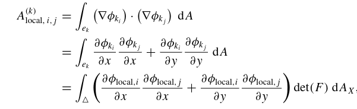
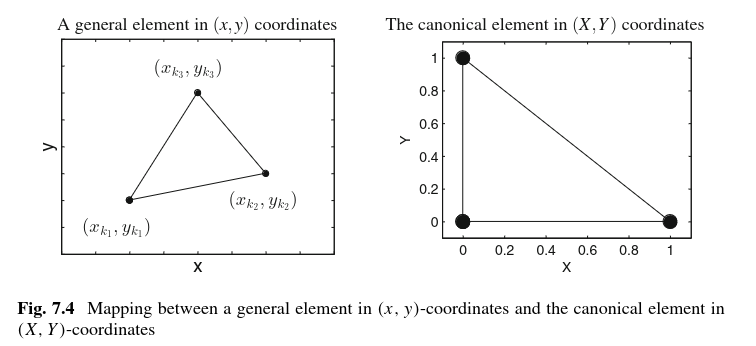
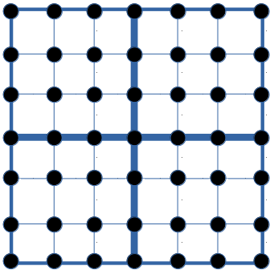
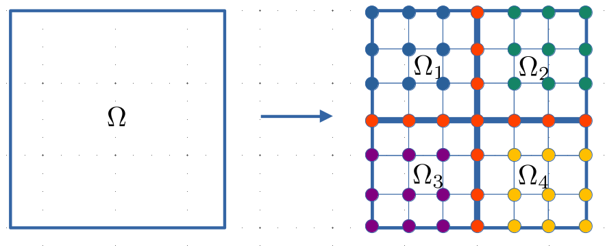
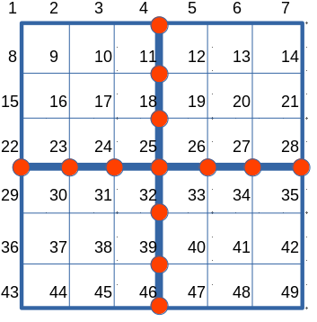

# PDEMethods

A Julia package for implementing numerical methods for canonical PDEs. General notes on PDEs, finite differences, and finite elements are dispersed throughout. Intended for self study only. The pronoun "we" is used to refer to both the reader and the author (Jared Frazier).

## Finite Difference Methods

### Forward, Centered, Backward Finite Differences

This section is based on chapter 8 of ref [1].

Given some differential equation $u'(x)$, one could approximate this derivative using a Taylor expansion of the function $u(x)$ (soln to diff eq) with derivative $u'(x)$ to some desired order. The general form of the taylor expansion is given below:

$$
f(a) = \sum_{n=0}^N \frac{f^{(n)}(a)}{n!} (x-a)^n
$$

See we are interested in the function perturbed by some infinitesimal $\Delta x$, we approximate
the function $u(x)$ to $N = 2$

$$
u(x + \Delta x) = u(x) + u'(x)(\Delta x) + \frac{1}{2}u''(x)(\Delta x)^2 + \mathcal{O}((\Delta x)^3)
$$

and claim that $x - a = \Delta x$ and since $a$ is just a variable we rename it to $x$ (see [here](https://math.stackexchange.com/questions/254792/how-is-the-taylor-expansion-for-fx-h-derived)). If we truncate the expansion to $N = 1$, then we see that

$$
u(x + \Delta x) = u(x) + u'(x)(\Delta x) + \mathcal{O}((\Delta x)^2)
$$

and solving for $u'(x)$, we get the **forward difference formula**:

$$
u'(x) \approx \frac{u(x + \Delta x) - u(x)}{\Delta x}
$$

One might also be interested in an infinitesimal perturbation to the "left" of the function at $x$, therefore we perform the same computation for $u(x - \Delta x)$,

$$
u(x - \Delta x) = u(x) + u'(x)(-\Delta x) + \frac{1}{2}u''(x)(-\Delta x)^2 + \mathcal{O}((-\Delta x)^3)
$$

and obtain the **backward difference formula**

$$
u'(x) \approx \frac{u(x - \Delta x) - u(x)}{-\Delta x} = \frac{u(x) - u(x - \Delta x)}{\Delta x}
$$

We are interested also in the **centered difference formula**, computed below.

$$
\begin{aligned}
u(x + \Delta x) - u(x - \Delta x) &= [u(x) + u'(x)(\Delta x)] - [u(x) + u'(x)(-\Delta x)] \\
&= 2u'(x)(\Delta x) \\
u'(x) &\approx \frac{u(x + \Delta x) - u(x - \Delta x)}{2 \Delta x}
\end{aligned}
$$

Since we often need an approximation for the second derivative as well, we add the two series where $N = 2$ together and solve for $u''(x)$ as shown below and get the **central difference formula for the second derivative**:

$$
\begin{aligned}
u(x + \Delta x) + u(x - \Delta x) &= [ u(x) + u'(x)(\Delta x) + \frac{1}{2}u''(x)(\Delta x)^2] \\&+ [u(x) + u'(x)(-\Delta x) + \frac{1}{2}u''(x)(-\Delta x)^2] \\
&= 2u(x) + u''(x)(\Delta x)^2 \\
u''(x) &= \frac{u(x + \Delta x) + u(x - \Delta x) - 2u(x)}{(\Delta x)^2}
\end{aligned}
$$

### The Five Point Stencil for the Laplace Equation in 2D

Note that for a PDE like the laplace equation in 2D

$$
\nabla^2f(x, y, t) = 0
$$

if we expand this out, we get

$$
\frac{\partial^2 f}{\partial x^2} + \frac{\partial^2 f}{\partial y^2} = 0
$$

and then using central difference scheme for the second derivative for each term

$$
\begin{aligned}
    \frac{\partial^2 f}{\partial x^2} &= \frac{f(x + \Delta x, y) + f(x - \Delta x, y) - 2f(x, y)}{(\Delta x)^2}\\
    \frac{\partial^2 f}{\partial y^2} &= \frac{f(x, y + \Delta y) + f(x, y - \Delta y) - 2f(x, y)}{(\Delta y)^2}
\end{aligned}
$$

and noting that on 2D grid, i.e. space has been discretized, $\Delta x = \Delta y = h$, then

$$
\begin{aligned}
\frac{\partial^2 f}{\partial x^2} + \frac{\partial^2 f}{\partial y^2} &= \frac{f(x + \Delta x, y) + f(x - \Delta x, y) + f(x, y + \Delta y) + f(x, y - \Delta y) - 4f(x, y)}{h^2} 
\end{aligned}
$$

and with the Laplace in particular that $\nabla^2f = 0$, we can solve for $f(x, y)$ for a given timestep but given the discretized grid, we claim that the grid is simply a matrix $U$ with elements $u_{i,j}$, so $f(x,y) = u_{i,j}$ and solving appropriately we finally get the following:

$$
u_{i,j} = \frac{u_{i+1,j} + u_{i-1, j} + u_{i, j+1} + u_{i, j-1}}{4}
$$

Since such a problem is an IVP and BVP, we have sufficient information to compute the solutions on the grid using an appropriate iterative method.

## Finite Element Methods

Overarching questions/observations:

* How does weak form change for (mixed) systems of DEs and how does it change for hyperbolic/parabolic PDEs? Elliptic PDE's (Laplace/Poisson) are canonical and easily studied.
* Assembly of matrices is entirely independent of one another (ideal for parallel programming?)
* Chapter 7 ref [8], "One word of caution is that the user should perform a check to ensure that the connectivity array does list the nodes of each element in an anticlockwise direction. This is straightforward to do—if the determinant of the Jacobian of the transformation between an element and the canonical element, given by Eq. (7.38), is negative, then the nodes are not listed in the correct order. If the nodes are not ordered correctly, then this may be fixed by interchanging the order of two nodes of that element in the connectivity array."
* The examples covered so far have been time independent (i.e., stationary); however, ref [5] shows time dependent (i.e., non-stationary) PDEs, and it seems the only additional step is finite difference discretization of any time related terms.

### Poisson's Equation in 2D

#### Poisson Weak Form Derivation

This section is based on refs [8] and chapter 3 and 7 of [9].

To derive the weak form of Poisson's equation in 2D, define the following

$$
\begin{equation}
-\nabla \cdot \nabla u = f 
\end{equation}
$$

with

$$
\begin{equation}
\begin{aligned}
    u(x, 0) &= 0 && \text{Dirichlet Boundaries} \\
    u(1, y) &= 0 \\
    u(x, 1) &= 0 \\
    u(0, y) &= 0 \\
    \text{in } \Omega &\in [0, 1] ^2 && \text{Domain}
\end{aligned}
\end{equation}
$$

Note that in order to derive the weak form, we must multiply equation (1) by $v$ where $v$ is a test function that belongs to a set of functions such that $\forall v \in H_0^1(\Omega)$ where $H_0^1(\Omega)$ is a subset of a Sobolev space $H^1(\Omega)$ elucidated below.

$$
H^1(\Omega) = \{\psi \in C^0(\Omega) \ | \int_{\Omega}(\psi)^2dx < \infty   \}
$$

This reads "$\psi$ is a continuous function on the domain $\Omega$ that is square integrable (that is square integration exists/is finite)".

Then, we are interested in two subsets of $H^1(\Omega)$ that are defined below.

$$
\begin{aligned}
H_E^1(\Omega) &= \{ \psi \in H^1(\Omega)\ |\ \psi\ \text{satisfies all Dirichlet boundary conditions}  \} \\
H_0^1(\Omega) &= \{ \psi \in H^1(\Omega)\ |\ \psi(\vec{x}) = 0\ \text{at all points}\ \vec{x}\ \text{where Dirichlet boundary conditions are specified} \}
\end{aligned}
$$

We thus have a definition for $\forall v \in H_0^1(\Omega)$ that will come up later.

Now, the weak formulation of equation (1) begins with the multiplication by a test function $v$ to both sides of the equation and then integration over the domain $\Omega$.

$$
\begin{equation}
-\int_{\Omega} v \nabla \cdot \nabla u\ d\Omega = \int_{\Omega}vf\ d\Omega
\end{equation}
$$

We want to simplify equation (3) to only have first derivatives (see [here](https://math.stackexchange.com/questions/754511/finite-element-method-weak-formulation?rq=1)) because having second derivatives is more difficult/costly to implement.

To do this, we define the vector calculus identity

$$
\begin{equation}
\nabla \cdot (v\vec{F}) = v(\nabla \cdot \vec{F}) + \nabla v \cdot \vec{F}
\end{equation}
$$

where $v$ is a scalar field and $\vec{F}$ is a vector field.

To use this in the derivation of the weak form of Poisson's equation, we simply state that $\vec{F} = \nabla u$, and substituting into equation (4),

$$
\begin{equation}
\nabla \cdot (v \nabla u) = \boxed{v(\nabla \cdot \nabla u)} + \nabla v \cdot \nabla u
\end{equation}
$$

noting that the boxed part of the equation (5) matches the form in equation (3).

Solving equation (5) for $v(\nabla \cdot \nabla u)$, accounting for the negative sign in front of $v$ in equation (3), and then integrating over the domain $\Omega$ gives

$$
\begin{equation}
-\int_{\Omega} v(\nabla \cdot \nabla u)\ d\Omega = -\int_{\Omega} \nabla \cdot (v \nabla u)\ d\Omega + \int_{\Omega} \nabla v \nabla u\ d\Omega 
\end{equation}
$$

and note that the Divergence theorem

$$
\int_{\Omega} \nabla \cdot \vec{A}\ d\Omega = \oint_{\partial \Omega = \Gamma} \vec{A} \cdot \vec{n}\ d\Gamma
$$

can be applied to

$$
\begin{equation}
\int_{\Omega} \nabla \cdot (v \nabla u)\ d\Omega = \oint_{\partial \Omega = \Gamma} v \nabla u \cdot \vec{n}\ d\Gamma 
\end{equation}
$$

by assigning $\vec{A} = v \nabla u$.

Substituting the right hand side equation (7) into equation (6) gives the below equation.

$$
-\int_{\Omega} v(\nabla \cdot \nabla u)\ d\Omega = - \oint_{\partial \Omega = \Gamma} v \nabla u \cdot \vec{n}\ d\Gamma + \int_{\Omega} \nabla v \nabla u\ d\Omega
$$

Finally, since $v(x, y) \in H_0^1(\Omega)$ and thus $v(x, y) = 0$ at all points where Dirichlet boundary conditions are specified, and the boundary domain is defined by $\partial \Omega$, then

$$
\oint_{\partial \Omega = \Gamma} v \nabla u \cdot \vec{n}\ d\Gamma = 0
$$

and the weak form of Poisson's equation is shown below.

$$
\boxed{\int_{\Omega} \nabla v \nabla u\ d\Omega = \int_{\Omega} vf\ d\Omega}
$$

#### The Finite Element Solution Given the Weak Form

When actually approximating the solution, piecewise lienar functions are used such that $\phi_1, ..., \phi_N$ are linearly independent functions in $H_0^1(\Omega)$ and they span an $N$-dimensional ($N$ is the number of finite elements) subspace $\mathcal{V}_N$ of $H_0^1(\Omega)$. Thus we approximate $u$ at each node of a finite element mesh via

$$
U = \sum_{j=1}^{N+1} U_j \phi_j
$$

and we only test $U$ against $v \in \mathcal{V}_N$ of the functions of a set $S^h$ of the form

$$
V = \sum_{j=1}^{N+1} V_j \phi_j
$$

(see ref [13] and chapter 5 of ref [8]). This is called **Galerkin's method for solving the PDE**, and fundamentally we seek to find $U \in S_E^h$ for all functions $\phi_i \in S_E^h$ (chapter 3 and 5 of ref [8]). This notation is just concretely asserting that the basis functions (something that we choose, e.g., linear functions) $\phi_i$ that will represent the test function $v$ are equal to 0 at all points where Dirichlet boundary conditions are applied (functions in set $S_0^h$), and the trial functions $U$ satisfy the Dirichlet boundary conditions (so functions in set $S_E^h$).

#### From Physical Coordinates to Local Coordinates

This section is based on chapter 7 of ref [8].

For a triangular finite element $k$, there are three nodes $k_1$, $k_2$ and $k_3$ and each of those nodes takes on a coordinate in the physical space $(x_{k_1}, y_{k_1}), (x_{k_2}, y_{k_2}), (x_{k_3}, y_{k_3})$. For integration purposes, we map the physical coordinates to the canoncial coordinates $X \in [0, 1] $ and $Y \in [0, 1]$. Therefore, local basis functions on an element $k$ are defined for each node such that

$$
\begin{aligned}
\phi_{\text{local}, 1}(X, Y) &= 1 - X - Y \\
\phi_{\text{local}, 2}(X, Y) &= X \\
\phi_{\text{local}, 3}(X, Y) &= Y
\end{aligned}
$$

When constructing the system of alegbraic equations for an element $k$, one needs to ensure that the coordinate transformation is observed in the integral. This is done by taking the determinant of the jacobian $F$ which can be generally described below.

$$
F = \begin{pmatrix}
\frac{\partial x_1}{\partial X_1} & \frac{\partial x_1}{\partial X_2} & \cdots & \frac{\partial x_1}{\partial X_d} \\
\vdots & \cdots & \cdots & \vdots \\
\frac{\partial x_d}{\partial X_1} & \cdots & \cdots & \frac{\partial x_d}{\partial X_d}
\end{pmatrix}
$$

for a domain $\Omega^d$. For example, in the 2D Poisson equation,

$$
F = \begin{pmatrix}
\frac{\partial x}{\partial X} & \frac{\partial x}{\partial Y} \\\\
\frac{\partial y}{\partial X} & \frac{\partial y}{\partial X}
\end{pmatrix}
$$

So, as a concrete case, see the below:

where the domain of the triangular element $e_k$ in the physical coordinates becomes $\Delta$ in the local (canonical) coordinates.

#### Proof of Vector Calculus Identity Relevant for General Elliptic PDEs

Prove the following vector calculus identity.

$$
\begin{aligned}
\nabla \cdot (vp\nabla u) &= v\nabla \cdot p\nabla u + p\nabla v \cdot \nabla u 
\end{aligned}
$$

Given this identity, one can easily rearrange to get the desired weak form from chapter 8 of ref[8].

$$
\begin{aligned}
-\nabla \cdot (vp\nabla u) &= -v\nabla \cdot p\nabla u - p\nabla v \cdot \nabla u \\
-\nabla \cdot (vp\nabla u) + p\nabla v \cdot \nabla u &= -v\nabla \cdot p\nabla u
\end{aligned}
$$

To prove the above identity, I basically follow [proof for product rule of divergence](https://proofwiki.org/wiki/Product_Rule_for_Divergence) but substitute $U = pv$ and $\mathbf{A} = \nabla u$:

$$
\begin{aligned}
\nabla \cdot (vp\mathbf{A}) &= \sum_{k=1}^n \frac{\partial (vpA_k)}{\partial x_k} && \text{Definition divergence} && \text{(s1)} \\
&= \sum_{k=1}^n vp\frac{\partial A_k}{\partial x_k} + \sum_{k=1}^n v \frac{\partial p}{\partial x_k}A_k + \sum_{k=1}^n \frac{\partial v}{\partial x_k} p A_k && \text{Product rule} && \text{(s2)} \\
&= vp \sum_{k=1}^n \frac{\partial A_k}{\partial x_k} + v \sum_{k=1}^n \frac{\partial p}{\partial x_k}A_k + p \sum_{k=1}^n \frac{\partial v}{\partial x_k} A_k && \text{Factor non-subscripted terms} && \text{(s3)} \\
&= vp\nabla \cdot \mathbf{A} + v \sum_{k=1}^n \frac{\partial p}{\partial x_k}A_k + p \sum_{k=1}^n \frac{\partial v}{\partial x_k} A_k && \text{Definition divergence} && \text{(s4)} \\
&= vp\nabla \cdot \mathbf{A} + v \left[ \sum_{k=1}^n \frac{\partial p}{\partial x_k}\mathbf{e_k} \cdot \sum_{k=1}^n A_k \mathbf{e_k}\right] + p\sum_{k=1}^n \frac{\partial v}{\partial x_k} A_k && \text{Definition dot product} && \text{(s5)} \\
&= vp\nabla \cdot \mathbf{A} + v \nabla p \cdot \mathbf{A} + p\sum_{k=1}^n \frac{\partial v}{\partial x_k} A_k && \text{Definition gradient} && \text{(s6)} \\
&= vp\nabla \cdot \mathbf{A} + v \nabla p \cdot \mathbf{A} + p \nabla v \cdot \mathbf{A} && \text{(s5) and (s6) on last term} && \text{(s7)} \\
&= vp\nabla \cdot \nabla u + v \nabla p \cdot \nabla u + p \nabla v \cdot \nabla u && \mathbf{A} = \nabla u && \text{(s8)} 
\end{aligned}
$$

The above proof could also be demonstrated by just using [vector calculus identities](https://en.wikipedia.org/wiki/Vector_calculus_identities)

$$
\begin{aligned}
\nabla(\psi \phi) &= \phi \nabla \psi + \psi \nabla \phi && \text{Product rule scalar fields}\\
\nabla \cdot (U \mathbf{A}) &= U \nabla \cdot \mathbf{A} + (\nabla U) \cdot \mathbf{A} && \text{Product rule scalar field, vector field} \\
&= \psi\phi \nabla \cdot \nabla u + [\phi\nabla\psi + \psi\nabla\phi] \cdot \nabla u , && U = \psi\phi, \mathbf{A} = \nabla u \\
&= \psi\phi\nabla \cdot \nabla u + \phi\nabla\psi \cdot \nabla u + \psi\nabla\phi \cdot \nabla u \\
&= vp\nabla \cdot \nabla u + p\nabla v \cdot \nabla u + v\nabla p \cdot \nabla u , && v = \psi, p = \phi
\end{aligned}
$$

Taking the final result of this equation, and aligning it with the desired identity,

$$
\begin{aligned}
\nabla \cdot (vp\nabla u) &= p\nabla v \cdot \nabla u + \boxed{v\nabla \cdot p\nabla u}  \\
&=p\nabla v \cdot \nabla u + \boxed{vp\nabla \cdot \nabla u  + v\nabla p \cdot \nabla u} 
\end{aligned}
$$

then I want to show if

$$
v\nabla \cdot p\nabla u \stackrel{?}{=} vp\nabla \cdot \nabla u  + v\nabla p \cdot \nabla u
$$

which can be shown by applying the product rule for scalar and vector field to the left hand side of the equation.

### Parabolic Partial Differential Equation in 2D

The following sections are based on chapters 3, 7, and 13 from [8].

#### Problem Statement

We will show the steps of deriving the weak form, discretizing the physical domain into a mesh of triangular finite elements, selecting suitable basis functions, formulating the weak form in terms of basis functions, and then describing the subsequent assembly of an algebraic system of equations. The original problem is given below, however we will use a backward finite difference to discretize time and also rearrange the formula to be a linear elliptic PDE.

$$
\begin{align}
\frac{\partial u}{\partial t} &= \nabla \cdot (\nabla u) + f(x, y, t) \\
f(x, y, t) &= e^{-t}(2x(1-x) + 2y(1-y) - xy(1-x)(1-y))
\end{align}
$$

Rearranging to the desired form,

$$
\begin{align}
\frac{u^{(m)} - u^{m-1}}{t_m - t_{m-1}} &= \nabla \cdot \nabla u^{(m)} + f(x,y, t_m) \\
\boxed{- \nabla \cdot \nabla u + \frac{u^{(m)}}{\Delta t}} &= \boxed{f + \frac{u^{(m-1)}}{\Delta t}}
\end{align}
$$

such that $x \in [0, 1], y \in [0, 1], t \in [0, 3], t_{m-1} < t \leq t_m, m \in [1...M]$ and the physical domain is defined by $\Omega$. The system is subject to the Dirichlet boundary conditions given by, for $0 < t < 3$:

$$
\begin{align}
u(x, 0, t) &= 0 && \text{Bottom} \\
u(1, y, t) &= 0 && \text{Right} \\
u(x, 1, t) &= 0 && \text{Top} \\
u(0, y, t) &= 0 && \text{Left}
\end{align}
$$

and the initial conditions

$$
\begin{equation}
u(x, y, 0) = xy(1-x)(1-y).
\end{equation}
$$

The differential equation has a solution

$$
\begin{equation}
u(x,y,t) = xy(1-x)(1-y)e^{-t}
\end{equation}
$$

#### Linear Elliptic PDE Weak Form Derivation

We multiply the rearranged PDE (the boxed PDE, henceforth referred to as the "governing PDE") by a function $v: \mathbb{R}^2 \rightarrow \mathbb{R}$ where $v \in H_0^1$ (the subset of the Sobolev space of order 1 for which all functions $\psi = 0$ in the space at Dirichlet boundary conditions). Note now that this equation is a linear elliptic PDE whereas previously it was a linear parabolic PDE. Following this multiplication, we integrate over the domain $\Omega$ and we simplify as much as possible since the goal is to form a linear system of equations ${\mathbf{A}\vec{U} = \vec{b}}$ (more on the time dependence later) where $\vec{U}$ is the finite solution for all nodes in a discretized mesh on the domain $\Omega$. Below shows the multiplication and integration over $\Omega$, with some comments as necessary.

$$
\begin{aligned}
-\int_{\Omega} v \nabla \cdot \nabla u^{(m)}\ d\Omega + \int_{\Omega} v \frac{u^{(m)}}{\Delta t}\ d\Omega &= \int_{\Omega} vf + v \frac{u^{(m-1)}}{\Delta t}\ d\Omega \\\\ % nl
-\left[\int_{\Omega} \nabla \cdot v \nabla u^{(m)} - \nabla v \cdot \nabla u^{(m)}\ d\Omega \right] + \int_{\Omega} v \frac{u^{(m)}}{\Delta t}\ d\Omega &= \int_{\Omega} vf + v \frac{u^{(m-1)}}{\Delta t}\ d\Omega && \text{Product rule} \\\\ %nl
-\left[\int_{\partial \Omega} v \nabla u^{(m)} \cdot \vec{n}\ ds - \int_{\Omega} \nabla v \cdot \nabla u^{(m)}\ d\Omega \right] + \int_{\Omega} v \frac{u^{(m)}}{\Delta t}\ d\Omega &= \int_{\Omega} vf + v \frac{u^{(m-1)}}{\Delta t}\ d\Omega && \text{Divergence}\\\\ %nl
\int_{\Omega} \nabla v \cdot \nabla u^{(m)} + v \frac{u^{(m)}}{\Delta t}\ d\Omega &= \int_{\Omega} vf + v \frac{u^{(m-1)}}{\Delta t}\ d\Omega && v \in H_0^1 \therefore \text{Weak Form} 
\end{aligned}
$$

#### Mesh and Basis Functions

The finite element solution of the model problem will be a linear approximation to the true solution on each canonical triangular element with a mesh with $N_x$ rectangles and $N_y$ rectangles with a diagonal through each rectangle creating the right triangles for the mesh. Nodes of element $k$ in a mesh of triangular elements are $k_1$, $k_2$, and $k_3$ and the corresponding physical coordinates are $x_{k_1}$, $x_{k_2}$, $x_{k_3}$ and $y_{k_1}$, $y_{k_2}$, $y_{k_3}$. The mapping between physical coordinates and the canonical coordinates is described by

$$
\begin{aligned}
x &= (1 - X - Y)x_{k_1} + X x_{k_2} + Y x_{k_3} \\\\
y &= (1 - X - Y)y_{k_1} + X y_{k_2} + Y y_{k_3}
\end{aligned}
$$

with local linear basis functions

$$
\begin{aligned}
\phi_{local, 1}(X, Y) &= \phi_{k_1}(X, Y) = 1 - X -Y \\\\
\phi_{local, 2}(X, Y) &= \phi_{k_2}(X, Y) = X \\\\
\phi_{local, 3}(X, Y) &= \phi_{k_3}(X, Y) = Y \\\\
\phi_{j}(X, Y) &= 0 && j \neq k_1, j \neq k_2, j \neq k_3
\end{aligned}
$$

and more generally, basis functions satisfy the condition that

$$
\phi_j(x_i) = \phi_j(x_i, y_i) = \begin{cases}
1, & i = j, \\
0, & i \neq j,
\end{cases}
$$

where $\phi_j(x_i) = \phi_j(x_i, y_i)$ are equivalent since by definition, the subscript of the two coordinates will be the same. They will never be something like $(x_{k_1}, y_{k_2})$ since such a point does not actually exist. See the below graphic from [8] as a visual "proof".

#### Functions Satisfying the Finite Element Solution

This is essentially the Sobolev space definitions from section [Poisson Weak Form Derivation](#poisson-weak-form-derivation) except the function $V$ is specified a linear combination of basis function $\phi$:

$$
\begin{aligned}
S^h &= \{ V : \Omega \rightarrow \mathbb{R}\ |\ V(x, y) = \sum_{j=1}^{N_{nodes}} V_j \phi_j(x, y) \} \\\\
S_E^h &= \{ V \in S^h\ |\ V \text{ satisfies all Dirichlet boundary conditions} \} \\\\
S_0^h &= \{ V \in S^h\ |\ V(x, y) = 0 \text{ at all points } (x, y) \text{ where Dirichlet boundary conditions are specfied} \}.
\end{aligned}
$$

#### The Finite Element Solution

We approximate the solution at each point in the mesh with

$$
U^{(m)}(x, y) = \sum_{j=1}^{N_{nodes}}U^{(m)}_j \phi_j(x, y)
$$

where $U^{(m)} \in S^h$ for a timestep $m$ and note that

$$
U^{(m)}_i = U^{(m)}(x_i, y_i)
$$

while the coefficients $U_j \in S_E^h$ such that the weak form now becomes

$$
\int_{\Omega} \nabla \phi_i \cdot \nabla U^{(m)} + \phi_i \frac{U^{(m)}}{\Delta t}\ d\Omega = \int_{\Omega} vf + v \frac{U^{(m-1)}}{\Delta t}\ d\Omega
$$

for all $\phi_i \in S_0^h$.

#### The System of Algebraic Equations

To assemble the system of algebraic equations, we assemble a system of $N_{node}$ algebraic equations for the unknown quantities $U_1^{(m)}, U_2^{(m)}, ..., U_{N_{nodes}}^{(m)}$. These equations are drawn from two sources: (i) equations that ensure the finite element solution satisfies the Dirichlet boundary conditions; and (ii) equations that arise from substituting suitable test functions $\phi_i \in S_0^h(\Omega)$.

##### Dirichlet Boundary Conditions

Since we imposed that ${U^{(m)} \in S_E^h}$, $U^{(m)}$ must satisfy Dirichlet boundary conditions, and suppose a node $i$ lies on boundary $\partial \Omega$, then to satisfy Dirichlet boundary conditions,

$$
\begin{equation} 
U_i^{(m)} = 0\ \forall (x_i, y_i) \in \partial \Omega.
\end{equation}
$$

This is clearly not the case though since from the defintiion of $U_i^{(m)}$ as a summation of basis functions $\phi$, then

$$
\begin{aligned}
U_i^{(m)} &= U^{(m)}(x_i, y_i) = \sum_{j=1}^{N_{nodes}} U_j^{(m)} \phi_j(x_i, y_i), && \phi_j(x_i) = 1 \text{ iff i = j}
\end{aligned}
$$

which implies that $U_i^{(m)}$ at a boundary does not equal 0, and thus $\phi_i \notin S_0^h(\Omega)$.

##### Suitable Test Functions

Not sure about logic here. Asked question [here](https://math.stackexchange.com/questions/4794378/suitable-test-functions-for-finite-element-solution-as-a-subset-of-s-0h-omega).

But in any case, the claim is that if a node $i$ does not lie on the boundary, $\partial \Omega$, then it follows that $\phi_i \in S_0^h$, and since

$$
\nabla U^{(m)}(x, y) = \sum_{j=1}^{N_{nodes}} U^{(m)}_j \nabla \phi_j(x, y)
$$

then one can substitute this into the weak form

$$
\int_{\Omega} \nabla \phi_i \cdot \sum_{j=1}^{N_{nodes}} U_j^{(m)} \nabla \phi_j + \phi_i \frac{\sum_{j=1}^{N_{nodes}} U_j^{(m)} \phi_j}{\Delta t}\ d\Omega = \int_{\Omega} vf + v \frac{U^{(m-1)}}{\Delta t}\ d\Omega
$$

and we leave $U^{(m-1)}$ as is, since this is a  vector with elements that are known from the previous iteration $m-1$ (or from initial conditions). Now the sum can actually be factored out, which I will show with a stripped down example below (which is just using distributive properties of dot products and commutativity of addition) just to convince the reader/author.

$$
\begin{aligned}
(\nabla \phi_i \cdot \sum_{j=1}^2 \nabla \phi_j) + \sum_{j=1}^2 \phi_j &= (\nabla \phi_i \cdot \left[ \nabla \phi_1 + \nabla \phi_2 \right]) + \left[ \phi_1 + \phi_2 \right] \\\\ 
&= (\nabla \phi_i \cdot \nabla \phi_1 + \nabla \phi_i \cdot \nabla \phi_2) + (\phi_1 + \phi_2)  \\\\
&= (\nabla \phi_i \cdot \nabla \phi_1 + \phi_1) + (\nabla \phi_i \cdot \nabla \phi_2 + \phi_2) \\\\
&= \sum_{j=1}^2 \nabla \phi_i \cdot \nabla \phi_j + \phi_j
\end{aligned}
$$

Therefore, the weak form becomes

$$
\begin{aligned}
\int_{\Omega} \sum_{j=1}^{N_{nodes}} \nabla \phi_i \cdot  U_j^{(m)} \nabla \phi_j + \phi_i \frac{U_j^{(m)} \phi_j}{\Delta t}\ d\Omega &= \int_{\Omega} vf + v \frac{U^{(m-1)}}{\Delta t}\ d\Omega  && \text{Factor sum} \\\\
\sum_{j=1}^{N_{nodes}} \int_{\Omega} \nabla \phi_i \cdot  U_j^{(m)} \nabla \phi_j + \phi_i \frac{U_j^{(m)} \phi_j}{\Delta t}\ d\Omega &= \int_{\Omega} vf + v \frac{U^{(m-1)}}{\Delta t}\ d\Omega && \text{Integral(Sums) == Sum(Integrals)} \\\\
\sum_{j=1}^{N_{nodes}} \int_{\Omega} (\nabla \phi_i \cdot \nabla \phi_j + \phi_i \frac{\phi_j}{\Delta t}) U_j^{(m)} \ d\Omega &= \int_{\Omega} vf + v \frac{U^{(m-1)}}{\Delta t}\ d\Omega && \text{Factor the scalar } U_j^{(m)}
\end{aligned}
$$

which can be written as

$$
\sum_{j=1}^{N_{nodes}} A_{i,j} U_j^{(m)} = b_i
$$

where

$$
\begin{aligned}
A_{i,j} &= \int_{\Omega} \nabla \phi_i \cdot \nabla \phi_j + \phi_i \frac{\phi_j}{\Delta t}\ d\Omega \\\\
b_{i} &= \int_{\Omega} vf + v \frac{U^{(m-1)}}{\Delta t}\ d\Omega
\end{aligned}
$$

##### The Linear System

This results in a linear system of equations for the time step $m$

$$
\begin{equation}
\mathbf{A}\vec{U} = \vec{b}.
\end{equation}
$$

It is important to recognize how the boundary conditions affect the assembly of the matrix $\mathbf{A}$. Since it is known that $U_i^{(m)}=0$ on the boundary, then if a node $i$ lies on the boundary,

$$
\begin{align}
A_{i,j} &= \begin{cases}
1, & j = i, \\
0, & j \neq i
\end{cases} \\\\
b_i &= 0
\end{align}
$$

which follows naturally from considering the follow example. If the node $i = 1$ lies on the boundary, then it is known from Dirichlet boundary conditions that $U_1 = 0$. To properly construct the linear system of equations, consider a finite element mesh of 3 nodes and the corresponding linear system of equations

$$
\begin{bmatrix}
A_{11} & A_{12} & A_{13} \\\\
A_{21} & A_{22} & A_{23} \\\\
A_{31} & A_{32} & A_{33}
\end{bmatrix}
\begin{bmatrix}
U_1 \\\\
U_2 \\\\
U_3 
\end{bmatrix} =
\begin{bmatrix}
b_1 \\\\
b_2 \\\\
b_3 
\end{bmatrix}
$$

where, given the boundary conditions, the first line of the system of equations is

$$
\begin{aligned}
A_{11} U_1 + A_{12} U_2 + A_{13} U_3 &= b_1 \\\\
1U_1 + 0U_2 + 0U_3 &= 0 \\\ 
U_1 &= 0
\end{aligned}
$$

and this requires that

$$
A = \begin{bmatrix}
1 & 0 & 0 \\\\
A_{21} & A_{22} & A_{23} \\\\
A_{31} & A_{32} & A_{33}
\end{bmatrix}
$$

where only $A_{11} = 1$ because $i = 1$ for $U_1 = 0$ and $A_{11}$ matches the first case since
$j = i = 1$.

To assemble the linear system, we observe that the entries of the linear system require an integral over the entire domain $\Omega$; however this is equivalent to a sum of integrals over individual elements. Thus, when a node $i$ does not lie on the boundary, the entries $A_{ij}$ and $b_i$ are defined by

$$
\begin{aligned}
A_{ij} &= \frac{1}{\Delta t} \sum_{k=1}^{N_{ele}} \int_{e_k} \nabla \phi_i \cdot \nabla \phi_j + \phi_i \phi_j\ d\Omega, \\\\
b_i &= \frac{1}{\Delta t}\sum_{k=1}^{N_{ele}} \int_{e_k} vf + v U^{(m-1)}\ d\Omega,
\end{aligned}
$$

where $N_{ele}$ is the number of elements in the mesh, and $e_k$ is the region occupied by element $k$.

However, consider that we are evaluating the basis functions defined in [Mesh and Basis Functions](#mesh-and-basis-functions) at nodes $k_1$, $k_2$, and $k_3$, that we know nonzero contributions from this element on $e_k$ will only occur for $A_{ij}$ such that ${i, j \in {k_1, k_2, k_3}}$. Therefore, the nonzero local contributions can be stored in a $3 \times 3$ matrix $\mathbf{A}_{local}^{(k)}$, where $A_{local, i, j}^{(k)}$ contributes to $A_{k_i, k_j}$ for $i = 1,2,3$, $j = 1,2,3$. Similarly, we calculuate the local contributions for $\vec{b}_{local}^{(k)}$ where $b_{local, i}^{(k)}$ contributes to $b_{k_i}$ for $i = 1,2,3$. So the entries of $A_{local}^{(k)}$ for $i=1,2,3$ and $j=1,2,3$ is

$$
\begin{aligned}
A_{local, i, j}^{(k)} &= \int_{e_k} \nabla \phi_i \cdot \nabla \phi_j + \phi_i \phi_j\ d\Omega, \\\\
&= \int_{e_k} (\frac{\partial \phi_{k_i}}{\partial x}\frac{\partial \phi_{k_j}}{\partial x} + \frac{\partial \phi_{k_i}}{\partial x}\frac{\partial \phi_{k_j}}{\partial y}) + \phi_{k_i} \phi_{k_j}\ d\Omega, \\\\
&= \int_{\triangle} \left[(\frac{\partial \phi_{local,i}}{\partial x}\frac{\partial \phi_{local,j}}{\partial x} + \frac{\partial \phi_{local,i}}{\partial x}\frac{\partial \phi_{local,j}}{\partial y}) + \phi_{local,i}\  \phi_{local,j}\right]det(F)\ d\Omega_{\triangle},
\end{aligned}
$$

where $\int_{\triangle}$ combined with $d\Omega_{\triangle}$ denotes integration over the canonical (reference) element, and $F$ is theJacobian matrix defined by

$$
\begin{aligned}
F &= \begin{pmatrix}
\partial x / \partial X & \partial x / \partial Y \\\\
\partial y / \partial X & \partial y / \partial Y 
\end{pmatrix} \\\\
&= \begin{pmatrix}
x_{k_2} - x_{k_1} & x_{k_3} - x_{k_1} \\\\
y_{k_2} - y_{k_1} & y_{k_3} - y_{k_1}
\end{pmatrix} 
\end{aligned}
$$

## Balancing Domain Decomposition by Constraints

Notes for the paper "A Preconditioner for Substructuring based on constrained Energy Minimization" (Dohrman 2003).

Given finite element equations

$$
\begin{equation}
\mathbf{K}\vec{u} = \vec{b}
\end{equation}
$$

essentially you will divide $\vec{u}$ into different degrees of freedom. Note that is a flattened degrees of freedom vector corresponding to nodes in the finite mesh as shown below.

Note that the domain $\Omega$ has been divded into substructures $\Omega = \{\Omega_i \}_{i = 1}^N$. As an example, consider N = 4, then the susbtructured finite element mesh with shared dofs in orange and internal dofs to each susbtucture in unique colors is as shown below. Note that for a substructure $\Omega_1$, it's dofs $u_1$ are the union of the blue nodes and the orange nodes on its boundary with $\Omega_2$ and $\Omega_3$.

Consider the matrix $C_i$ where each row of $C_i$ are coarse dof common to two more substructures. See below for just the coarse dofs and with all nodes labeled with a flat index. **TODO**: THIS IS NOT COMPLETE.

Then the corresponding matrix for four substructures

$$
C_1 = \begin{bmatrix}
u_{4} & u_{11} & u_{18} & u_{25} \\
u_{22} & u_{23} & u_{24} & u_{25} 
\end{bmatrix}
$$

# References

[1] Heath, M. T. (2002). Scientific Computing: An Introductory Survey.
Boston: McGraw-Hill. ISBN: 0072399104

[2] Tobin A. Driscoll, Richard J. Braun. Fundamentals of Numerical Computation: Julia Edition. SIAM-Society for
Industrial and Applied Mathematics, 2022. url: https://tobydriscoll.net/fnc-julia/frontmatter.html

[3] Georgoulis, M. (2009). Computational Methods for Partial Differential
Equations. url: http://users.math.uoc.gr/~tsogka/Courses/AESDE-spring2015/Biblio/Georgoulis_notes_new.pdf

[4] Pawar S, San O. CFD Julia: A Learning Module Structuring an Introductory
Course on Computational Fluid Dynamics. Fluids. 2019; 4(3):159.
https://doi.org/10.3390/fluids4030159

[5] Simpson, G. (2017). Practical finite element modeling in Earth science using MATLAB. Wiley.

[6] Darve, E., Wootters, M (2021). Numerical Linear Algebra with Julia. SIAM.

[7] Recktenwald, G.W. Finite-difference approximations to the heat equation. Mechanical
Engineering. 2004; 10(1).

[8] Whiteley, J. (2017). Finite Element Methods: A Practical Guide. Springer.

[9] Aerodynamic CFD. "Deriving the Weak Form in 2D for Poisson's Equation".
(2018). url: https://www.youtube.com/watch?v=0dDrzGPFekM

[10] Wikipedia: Vector Calculus Identities. url: https://en.wikipedia.org/wiki/Vector_calculus_identities

[11] Brenner, S.C., Scott, L.R. (2008). "The Mathematical Theory of Finite Element Methods 3ed". Springer.

[12] Wikipedia: Integration by Parts. url: https://en.wikipedia.org/wiki/Integration_by_parts

[13] Sullivan, T.J. "A brief introduction to weak formulations of PDEs and the finite element method". University of Warwick. url: https://warwick.ac.uk/fac/sci/hetsys/studentinformation/induction/mathsinduction/pde/pde.pdf

[14] Sullivan, T.J (2015). "Introduction to Uncertainty Quantification". Springer.

[15] Dolean, V., Pierre, J., Nataf, F. (2015). "An Introduction to Domain 
Decomposition Methods: Algorithms, Theory, and Parallel Implementation". (SIAM).
