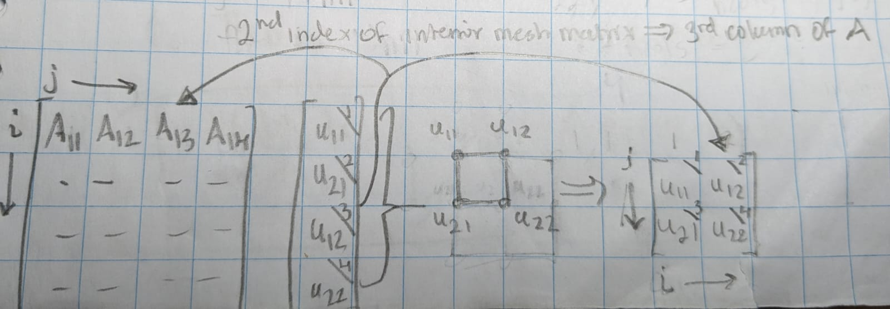

## Indexing for `laplace_eq_init_arrays`

Below is an image depicting a 2D interior mesh with only 4 nodes (i.e., $2 \times 2$) with global indices of the solution vector $\vec{u}$ marked in the corner of cell and global indices of the interior mesh matrix (far right) also in corner of cell. This odd scheme is why the indexing is the way it is in the function `laplace_eq_init_arrays` from Heath chapter 11.

